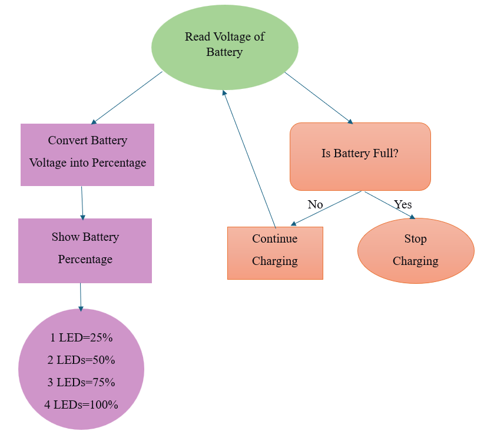
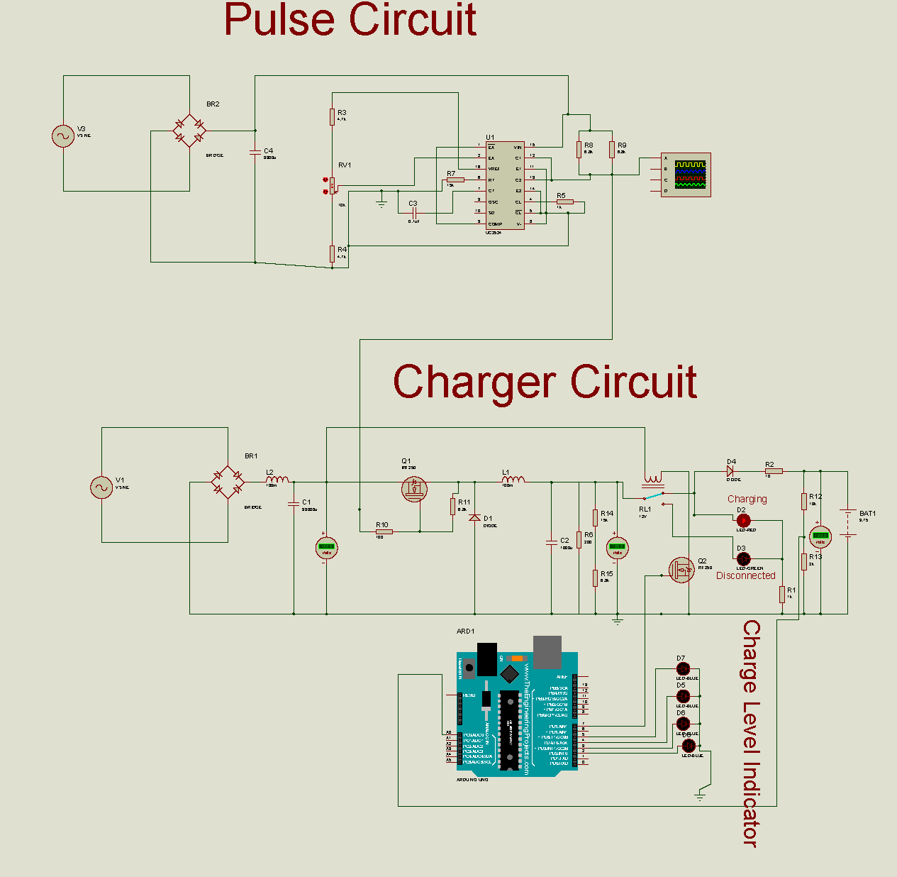
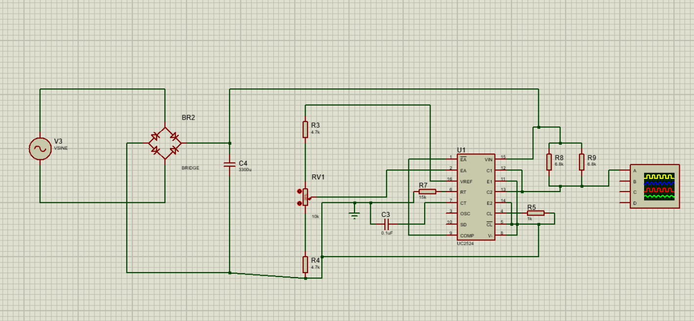
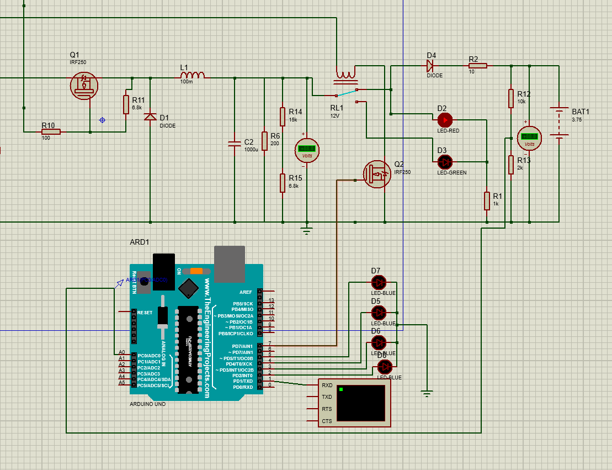

# Auto Cut-Off Battery Charger and Smart Battery Level Indicator

**Course:** EEE 316 - Power Electronics Laboratory  
**Domains:** Power Electronics, Hardware Design, Circuit Prototyping  

## Project Overview
This project presents the design and hardware implementation of an **Auto Cut-Off Battery Charger** integrated with a **Smart Battery Level Indicator**. The system is designed to efficiently charge batteries while protecting them from overcharging, thereby extending battery lifespan and ensuring safe operation. Once the battery reaches its full charge threshold, the circuit automatically cuts off the power supply.

## System Architecture
The system operates by converting AC mains to DC, monitoring the battery voltage, and utilizing a relay to cut power once the maximum threshold is reached.

*Figure: Block diagram of the proposed system architecture.*

## Key Features
* **Automatic Overcharge Protection:** Automatically disconnects the charging circuit when the battery is fully charged.
* **Smart Level Indication:** Provides real-time visual feedback on the current battery charge level.
* **Cost-Effective Design:** Built using accessible power electronics components with a total prototype cost of approximately 2,310 BDT.
* **Robust Hardware:** Implemented on a PVC board with reliable power regulation.

## Circuit Design & Schematics

### Full Circuit Overview
The complete system integrates power conversion, voltage sensing, and logic control to ensure safe charging operations.

*Figure: Complete circuit schematic of the Auto Cut-Off Battery Charger.*

### Sub-Circuits
To achieve the auto cut-off and visual indication features, the design relies on specific sub-circuits for generating control pulses and sensing voltage levels.

**Pulse Generation Circuit:**

**Auto Cut-Off and Indicator Circuit:**

## Hardware Implementation
The final prototype was successfully soldered and mounted onto a PVC board, integrating the transformer, control ICs, relays, and LED indicators.

*Figure: Final hardware implementation of the battery charger.*

y waste and adding advanced fault detection and thermal management.
